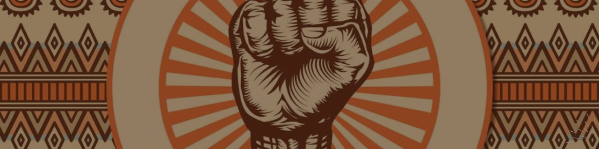
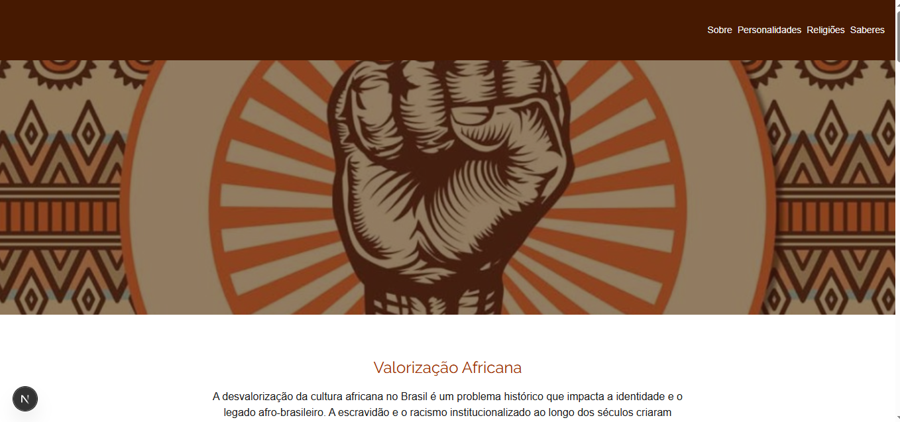
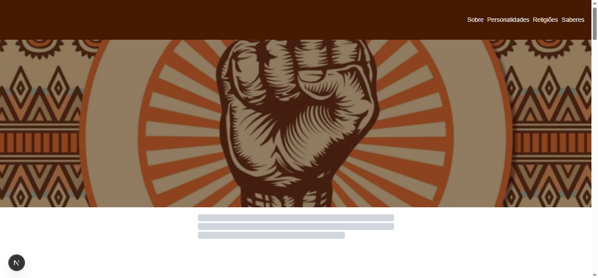
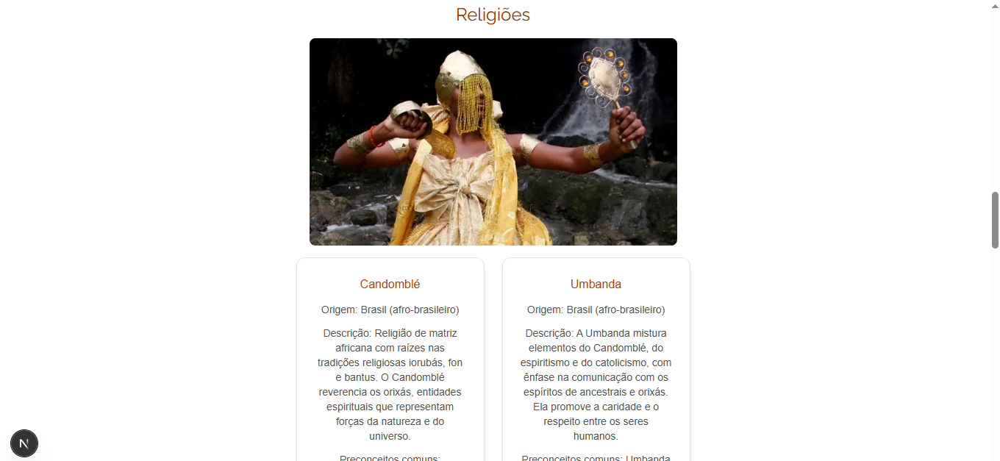
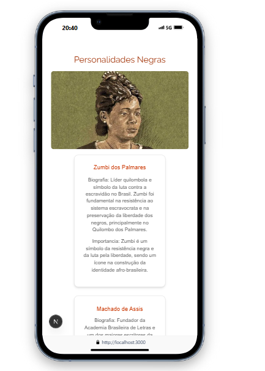

# ✊🏿 Valorização da Cultura Africana no Brasil



## ✏ Contextualização

A cultura africana é uma das principais raízes da formação cultural, religiosa e social brasileira. Contudo, historicamente, ela foi marginalizada por meio do racismo, escravidão e apagamento cultural. Este projeto tem como objetivo **valorizar e destacar a herança africana no Brasil**, através de uma interface web que informa sobre **personalidades negras**, **saberes tradicionais** e **religiões de matriz africana**, com base em dados de uma API externa.

---

## 💻 Tecnologias Utilizadas

| Tecnologia | Versão |
|------------|--------|
| [Next.js] | 15.3.4  |
| [React] | 19.0.0    |
| [Tailwind CSS] | ^4 |
| [TypeScript] | ^5   |

### API externa
Além das tecnologias usadas já citadas, ainda temos a api externa, que está disponível no repositório: https://github.com/tereza713/valorizacao-africana-no-Brasil

---
## ❓ Como executar o projeto
### Pré-requisitos

- [Node.js] (versão 19 ou superior)
- Git

### Passos

```bash
# Clone o repositório
git clone https://github.com/tereza713/frontend-valorizacao-africana.git

# Acesse a pasta
cd frontend-valorizacao-africana

# Instale as dependências
npm install

# Execute o servidor de desenvolvimento
npm run dev
```
---

### 📸 Imagens do Projeto

| Página Inicial | Skeleton de carregamento  |
|----------------|--------------------------|
|  |  |

| Seção de Religiões | Mobile View |
|---------------------|--------------|
|  |  |

